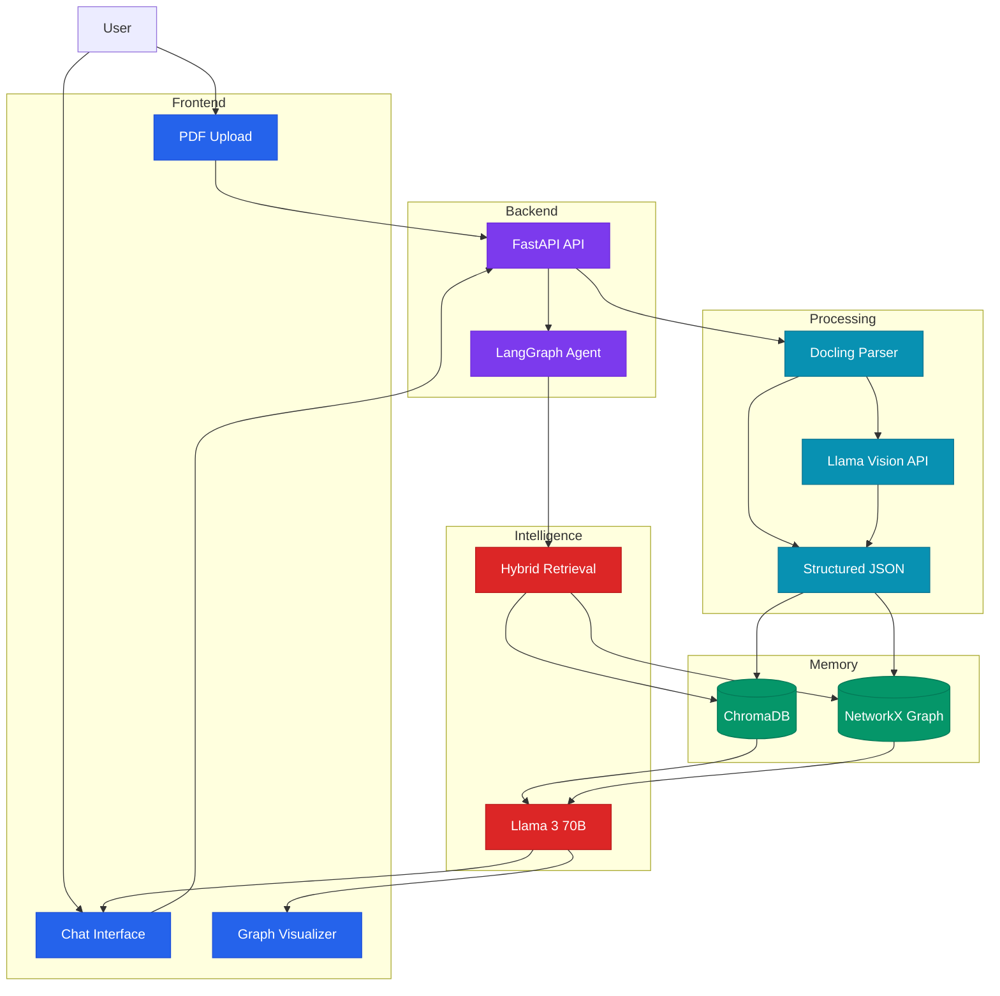

```mermaid
flowchart TB

    User[User]

    subgraph Frontend
        Upload[PDF Upload]
        Chat[Chat Interface]
        Visualizer[Graph Visualizer]
    end

    subgraph Backend
        FastAPI[FastAPI API]
        Agent[LangGraph Agent]
    end

    subgraph Processing
        Docling[Docling Parser]
        Vision[Llama Vision API]
        JSON[Structured JSON]
    end

    subgraph Memory
        Chroma[(ChromaDB)]
        Graph[(NetworkX Graph)]
    end

    subgraph Intelligence
        Retrieval[Hybrid Retrieval]
        LLM[Llama 3 70B]
    end

    User --> Upload
    User --> Chat

    Upload --> FastAPI
    FastAPI --> Docling

    Docling --> Vision
    Docling --> JSON
    Vision --> JSON

    JSON --> Chroma
    JSON --> Graph

    Chat --> FastAPI
    FastAPI --> Agent

    Agent --> Retrieval
    Retrieval --> Chroma
    Retrieval --> Graph

    Chroma --> LLM
    Graph --> LLM

    LLM --> Chat
    LLM --> Visualizer

    classDef frontend fill:#2563eb,color:#fff,stroke:#1d4ed8
    classDef backend fill:#7c3aed,color:#fff,stroke:#6d28d9
    classDef processing fill:#0891b2,color:#fff,stroke:#0e7490
    classDef memory fill:#059669,color:#fff,stroke:#047857
    classDef intelligence fill:#dc2626,color:#fff,stroke:#b91c1c

    class Upload,Chat,Visualizer frontend
    class FastAPI,Agent backend
    class Docling,Vision,JSON processing
    class Chroma,Graph memory
    class Retrieval,LLM intelligence
```